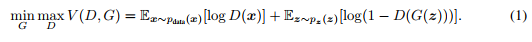
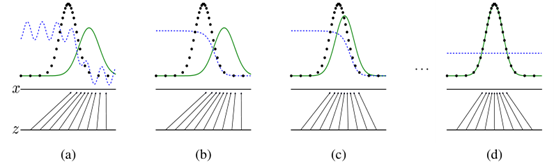

生成对抗网络

作者：xxx

摘要

我们提出了一个应用对抗过程来估算生成模型的新框架，在这个框架中我们同时训练了两个模型，分别是一个能捕捉数据分布的生成模型 *G* 和一个判别模
型 *D*, *D* 可以估计一个来自训练数据而非模型 *G* 的样本的概率。*G* 的训练过程的目的是最大化 *D* 出错的概率。这个框架对应于一个二元极小
极大博弈问题（minimax two-player game）。在任意的函数 *G* 和 *D* 组成的空间中，当 *G* 重建训练数据的发布以及 *D* 处处都等于
$$ \frac{1}{2} $$ 时，一个唯一解存在。当在 *G* 和 *D* 都被定义成多层感知器时，整个系统可以用反向传播算法来训练。在整个训练或生成样本时
并不需要任何马尔可夫链（Markov chains）或展开的近似推断网络。通过对生成样本定性和定量的评估，我们用实验展示了这个框架的潜力。

### 1. 介绍

深度学习的未来目标是发掘丰富的层次模型，这些模型可以用来表示在人工智能应用中遇见的各种数据的概率分布，比如自然图像，包含语音的音频和自然语
言词库中的符号。到目前为止，深度学习中最突出的成果之一是判别模型，它们通常能将一些高维，丰富的特征输入映射到类别标签上。这些显著的成果主要
基于反向传播和丢弃（dropout）算法，以及使用了具有良好梯度性质的分段线性单元。由于在最大似然估计和相关策略中出现的难以估计很多难解决的概率
计算的问题和在生成内容时很难利用分段线性单元优点的问题，深度生成模型的影响越来越小了。我们提出了一个全新的能够绕开这些困难的生成模型估算流
程。

在我们提出的这个对抗网络框架中，生成模型是和另外一个模型对立的，相互对抗的，这个模型就是一个学习决定样本是不是来自于 *G* 模型分布还是来自
数据分布的判别模型。生成模型可以类比于一群假币伪造团伙，他们的目的是生产假币并且在躲避侦查的情况下使用假币，而判别模型可以类比于试图检测到
伪造的货币的警察。这种博弈之中的竞争促使着两支队伍都在提高他们的技术直到假币和真的货币无法区分。

这个框架可以针对于各种模型和优化算法产生特定的训练算法。在这篇文章中，我们探讨了当生成模型通过将随机噪声通过多层感知器来生成样本并且判别模
型也是多层感知器时的特殊案例。我们把这个特俗案例称为对抗网络。在这个案例中，我们可以只用很成熟的反向传播算法和丢弃算法来训练两个模型以及
只用正向传播算法来从生成模型中采样而不需要近似推断或马尔可夫链。

### 2. 相关工作

一种带有隐变量的有向图模型的代替品是带有隐变量的无向图模型，比如限制玻尔兹曼机（RBMs），深度玻尔兹曼机（DBMs）和他们的很多变种。这类模型
中的关系是由被所有随机变量的和或积分归一化的未归一化的潜在函数的乘积表示的。这个除了个别简单情况下，这些量（配分函数）和他们的梯度是很难解
的，尽管他们可以用马尔可夫链蒙特卡洛（MCMC）方法来近似。混合使用依赖于MCMC方法的算法也存在很大的问题。

深度信念网络（DBNs）是一种包含一层无向层和多层有向层的混合模型。当需要快速逐层估计训练时，深度信念网络可能导致无向模型和有向模型计算困难的
问题。

还有另一些不需要估计或限制对数似然的判别准则，比如分数匹配和噪音压缩评估（NCE）。这两种都需要先验概率密度知识用来解析地指定一个规范化的常
量。注意到在很多有趣的带有多层隐变量的生成模型（比如DBNs和DBMs）中，甚至连推导计算一个简单的未归一化概率密度都不可能。有些模型比如去噪自
编码器和收缩自编码器有些类似于应用于RBMs中的分数匹配的学习规则。在NCE中，如同在我们的这个工作中一样，一个判别训练标准被用于拟合生成模型。
但是，不同于拟合一个独立的判别模型，生成模型在分开生成数据和从固定噪声分布中的所抽样的样本的过程中直接被使用。因为 *NCE* 使用了一个固定的
噪声分布，学习过程在模型从观测变量的一小部分子集中学习到一个大致正确的分布后学习速度急剧减慢了。

最后，有些技术不涉及线性地定义一个概率分布，而是训练一个生成器去从想要的分布中采样。这种方法有着能被设计成用反向传播算法训练生成器的优势。
最近在这个领域有一些优秀的工作，包括生成随机网络（GSN）框架，可以被拓展为一个生成去噪自编码器，这两者都可以被看成他们定义了一个参数化的马
尔可夫链，即一个通过执行生成马尔科夫链的一个步骤来学习机器参数的算法。和GSNs相比，对抗网络采样时不需要用到马尔可夫链。因为对抗网络在生成时
不需要反馈，他们更擅长利用分段线性单元的优势，能够提高反向传播的表现尽管当使用无界限的激活函数的时候会有一定问题。最近的一些用反向传播训练
生成器的例子包括自编码变分贝叶斯和随机反向传播。

### 3. 对抗网络

当模型都是多层感知器的时候，对抗模型框架最容易应用。为了学习生成器关于数据 **x** 的分布 $$p_g$$， 我们定义了一个输入噪声变量上的先验 $$p_z(z)$$,
然后使用$$G(z;\theta_g)$$来表示数据空间的映射，其中G是用参数\theta_g相关的多层感知器表示的一个可微方程。我们也定义了第二个输出为单个标
量的多层感知器$$D(z;\theta_d)$$。其中D（x）代表了来自数据而非$$p_g$$的概率x。我们训练D来使得最大化将正确的标签分配给训练样本和来自G的
样本的概率。我们也同时训练G来最小化$$log(1-D(G(z))$$。换句话说，D和G的训练是关于值函数$$V(D;G)$$的极小化极大的二人博弈问题：

在下一个部分，我们展示了对对抗网络的理论分析，从本质上展现了训练准则允许我们当G和D有足够容量的时候，即在没有参数限制的时候能够重建数据生成
分布。关于该方法的解释可以参见图一。实际上，我们必须使用迭代数值方法来实现这个过程。在内部循环中通过优化D去实现算法在计算上是不可能的，以及
当在有限的数据集上的时候会导致过拟合。相反，我们在优化D的k步和优化G一步之间交替。这能使得只要G改变得足够慢，D能一直保持在最优解的附近。这
个策略类似于SML/PCD训练用的方法，其在学习过程中保持从马尔可夫链中的采样不变来避免在内部循环中含有马尔可夫链的计算。该训练过程可以参见算法1。

实际上，方程一也许不能为G充分学习提供足够的梯度。训练初期，当G的效果很差时，D会以高置信度来拒绝生成样本，因为它们与训练数据明显不同。在这种
情况下，$$log(1-D(G(z))$$饱和了。因此我们训练G去最大化$$logD(G(z))$$而不是训练G去最小化$$log(1-D(G(z))$$。这个目标函数使G和D的动力
学稳定点相同但能够在学习的早期提供更大的梯度。

图一：生成对抗网络

### 4. 理论结果

### 5. 实验

### 6. 优点与缺点

相比于之前的模型框架，这个框架既有优点又有缺点。缺点主要是其没有显性地表示$$p_g(x)$$，以及 *D* 的训练要和 *G* 的训练同步得很好（特别的，
*G* 不能一味地训练 *D* 而不及时更新 *G*，为了避免海奥维提卡情景（the Helvetica Scenario）即 *G* 模型将太多的z值折叠为相同的x值，以至
于没有足够的多样性来建模$$p_data$$），很大程度上与玻尔兹曼机中的负向链必须在学习过程中保持及时的更新相似。我们所提出的框架的优点是我们不
需要马尔可夫链，在获取梯度时只有反向传播是需要的。并且不需要推断，而且大量多种函数可以被结合在模型中。表2总结了生成对抗网络和各种不同的生
成模型方法之间的对比。

上面提到的优点主要是在计算上的。对抗模型也可以从生成网络不直接通过数据样本中但通过判别器中的梯度流更新获取统计优势。这意味着输入中的元素没
有被直接复制进生成器的参数中。另一个对抗网络的优点是他们可以表示非常尖锐甚至简并的分布，而基于马尔可夫链的方法却需要分布更加模糊些以便于马
尔可夫链能够在各种模式之间混合。

### 7. 总结和将来的工作

这个框架允许许多简易的拓展：

1. 通过将 **c** 加入 *G* 和 *D* 中可以得到条件生成模型$$p(x|c)$$。
2. 通过训练一个辅助网络，学习近似推断可以被用于预测给定 **x** 情况下的 **z**。
3. c
